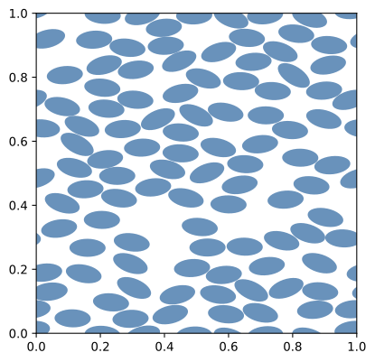

=================================
MD Ellipses with voronoi analysis
=================================

Input file
==========

The file for this tutorial is named ``MD_Ellipses.mgsim``. The input file can be run by executing the following command in a terminal console window:

.. code-block:: console

    python3 -m geommicgen '../geommicgen/resources/examples/MD_Ellipses.mgsim'

Replacing with the path to the input file according to the location of the GMMD repository in your computer.

The full text of the input file is:

.. literalinclude:: ../../../../geommicgen/resources/examples/MD_Ellipses.mgsim
    :language: xml

Phases
======

The microstructure has two phases:

- a matrix phase, described by::

    Phase 0
    Phase_Type 1

- and an ellipse phase, described by::

    Phase 1
    Phase_Type 3
    n 100
    vf 0.5
    angle_distribution normal
        angle_mean 0
        angle_sigma 0.2
    ratio 2

The microstructure contains 100 ellipses with a volume fraction of 0.5. The ratio between the major and minor axis of the ellipses is 2, and their orientation angle follows a normal distribution with mean 0 and standard deviation 0.2.

Generation Method
=================

This example uses a molecular dynamics simulation to generate the microstructure. The maximum number of iterations is 100 and the speed up scheme used is Verlet, with a Verlet factor of 1.1.

Output files
============
After running the command, a folder named ``MD_Ellipses`` will be created in the same directory as the input file. This folder contains all the output data related to the microstructure generation.
A .pdf file of the final microstructure is created with the line ``final_config True`` in the input file, and a Voronoi analysis of the microstructure is performed and plotted..

    Final configuration of the microstructure.

    Voronoi diagram of the final microstructure configuration.
