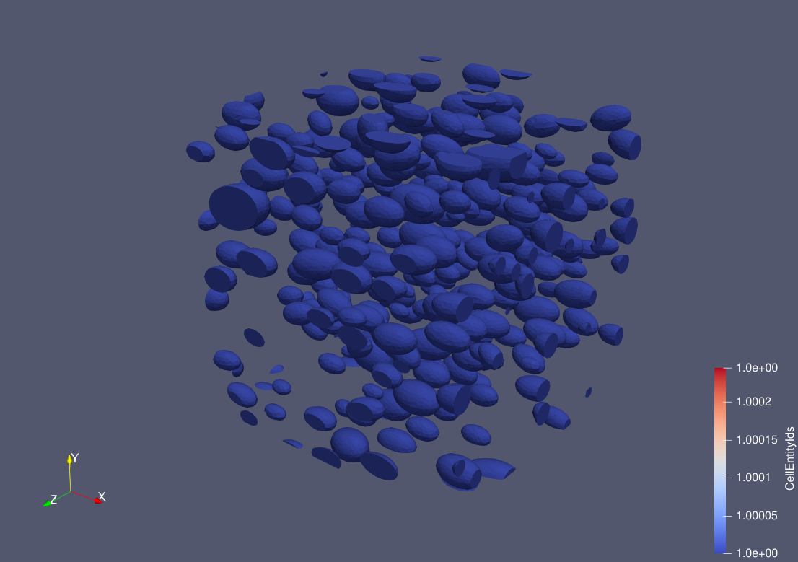
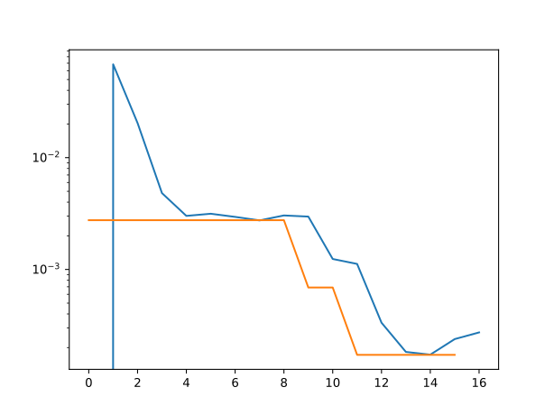
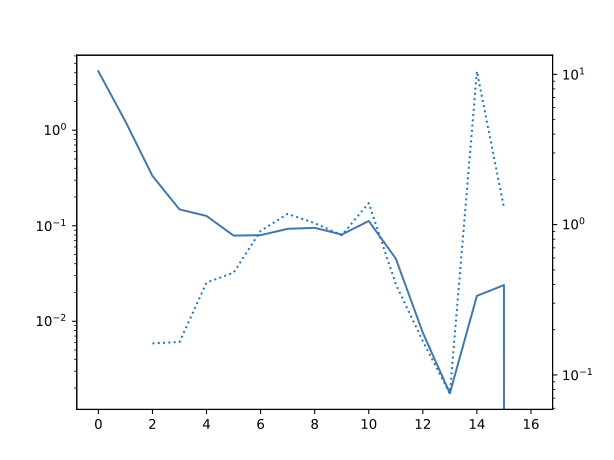
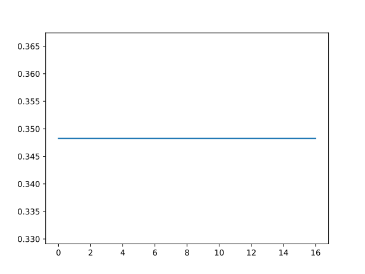

=============
MD Ellipsoids
=============

Input file
==========

The file for this tutorial is named ``MD_Ellipsoids.mgsim``. The input file can be run by executing the following command in a terminal console window:

.. code-block:: console

    python3 -m geommicgen '../geommicgen/resources/examples/MD_Ellipsoids.mgsim'

Replacing with the path to the input file according to the location of the GMMD repository in your computer.

The full text of the input file is:

.. literalinclude:: ../../../../geommicgen/resources/examples/MD_Ellipsoids.mgsim
    :language: xml

Phases
======

The microstructure has two phases:

- a matrix phase, described by::

    Phase 0
    Phase_Type 1

- and an ellipsoid phase, described by::

    Phase 1
    Phase_Type 5
    vf 0.1
    axis_1_distribution normal
    axis_1_mean 0.125
    axis_1_sigma 0.025
    ratio_12_distribution normal
    ratio_12_mean 1.7
    ratio_12_sigma 0.1
    ratio_13_distribution normal
    ratio_13_mean 1.7
    ratio_13_sigma 0.1
    rot_axis_comp_x 0
    rot_axis_comp_y_distribution uniform
    rot_axis_comp_y_low -1
    rot_axis_comp_y_high 1
    rot_axis_comp_z_distribution uniform
    rot_axis_comp_z_low -1
    rot_axis_comp_z_high 1
    angle_distribution normal
    angle_mean 0.1
    angle_sigma 0.2

The microstructure is generated in a cubic RVE of unit dimensions and contains ellipsoids with a volume fraction of 0.1. The principal axis ``axis_1`` follows a normal distribution with mean 0.125 and standard deviation 0.025, and the ratios between this axis and the other two principal axes (``ratio_12`` and ``ratio_13``) both follow a normal distribution with mean 1.7 and standard deviation 0.1, so that, on average, the ellipsoids are elongated along their first principal axis.
The orientation of each ellipsoid is defined by a rotation axis and a rotation angle. The x-component of the rotation axis is fixed at 0, while its y- and z-components follow a uniform distribution between -1 and 1. The rotation angle follows a normal distribution with mean 0.1 and standard deviation 0.2.

Generation Method
=================

This example uses a molecular dynamics simulation to generate the microstructure. The maximum number of iterations is 200 and the speed up scheme used is Verlet, with a Verlet factor of 1.1. A minimum distance of 0.002 between particles is imposed.

Output files
============
After running the command, a folder named ``MD_Ellipsoids`` will be created in the same directory as the input file. This folder contains all the output data related to the microstructure generation.
A .vtk file of the final microstructure is created with the line ``final_config True`` in the input file. This file can be opened in a 3D visualization tool, such as ParaView.

Since ``Motion_Analysis True`` is set in the input file, a motion analysis of the molecular dynamics simulation is also performed. During the simulation, GMMD keeps track, at every iteration, of the adaptive time step used by the Verlet speed-up scheme, the kinetic energy of the system of particles together with the target thermal energy imposed by the thermostat, and the total overlap between particles, which is the quantity driving the repulsive forces between them. These quantities are plotted as a function of the iteration step and give insight into the convergence and stability of the simulation: the time step history shows how the integration step is adapted throughout the run, the kinetic energy history shows how the agitation of the particles evolves relative to the thermostat's target, and the relative energy history shows the total overlap between particles decreasing towards the imposed maximum residue as the microstructure approaches a valid, non-overlapping configuration.

    Final configuration of the microstructure.

   Kinetic energy history

   Relative energy history

    Time step history.

