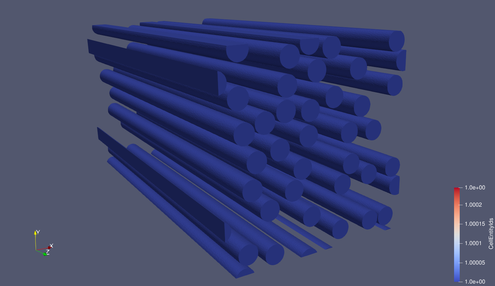
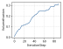

==========
RSA Fibers
==========

Input file
==========

The file for this tutorial is named ``RSA_fiber.mgsim``. The input file can be run by executing the following command in a terminal console window:

.. code-block:: console

    python3 -m geommicgen '../geommicgen/resources/examples/RSA_fiber.mgsim'

Replacing with the path to the input file according to the location of the GMMD repository in your computer.

The full text of the input file is:

.. literalinclude:: ../../../../geommicgen/resources/examples/RSA_fiber.mgsim
    :language: xml

Phases
======

The microstructure has two phases:

- a matrix phase, described by::

    Phase 0
    Phase_Type 1

- and a long cylindrical fiber phase, described by::

    Phase 1
    Phase_Type 6
    r 0.05
    vf 0.3
    direction 2

The fibers have a fixed radius of 0.05 and a volume fraction of 0.3. They are all aligned along direction 2, the third dimension of the RVE.

Generation Method
=================

This example uses a Random Sequential Adsorption simulation to generate the microstructure. The maximum number of iterations is 10000, the speed up scheme used is Cell and a minimum distance of 0.002 between particles is imposed.

Output files
============
After running the command, a folder named ``RSA_fiber`` will be created in the same directory as the input file. This folder contains all the output data related to the microstructure generation.
A .vtk file of the final microstructure is created with the line ``final_config True`` in the input file. This file can be opened in a 3D visualization tool, such as ParaView, which was used to produce the image below.
The volume fraction as a function of the step is also plotted.

    Final configuration of the microstructure.

    Volume fraction as a function of the step.
