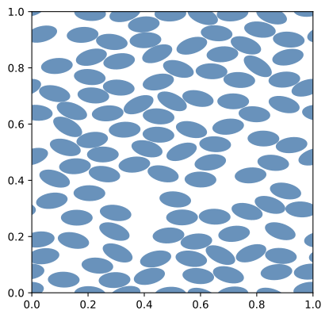

=================================
Voronoi analysis
=================================

This software aims to generate microstructures for random heterogenoeus materials. The microstructure can be simulated using finite element analysis. The Vonoroi analysis is here used to access if the microstructure is random or if there is any clustering or order.

This example focuses, then, on the Voronoi analysis. The microstructure descriptors and the generation method are the same as in :ref:`example_MD_Ellipses`, the only difference is that we now added the voronoi analysis.

Input file
==========

To run this example, open a termial inside the ``GMMD`` repository and run the following command:

.. code-block:: console

    python3 -m geommicgen '../geommicgen/resources/examples/MD_Ellipses_voronoi.mgsim'

The full text of the input file is:

.. literalinclude:: ../../../../geommicgen/resources/examples/MD_Ellipses_voronoi.mgsim
    :language: xml

Output files
============
After running the command, a folder named ``MD_Ellipses_voronoi`` will be created in the same directory as the input file
A .pdf file of the final microstructure is created along with several files regarding the Voronoi analysis.

plot_imts plots the Voronoi diagram including the values of the Irreducible Minkowski Tensors corresponding to each cell.

    Final configuration of the microstructure.

    Voronoi diagram of the final microstructure configuration.

.. include:: /_includes/previous_button.inc

.. include:: /_includes/next_button.inc
