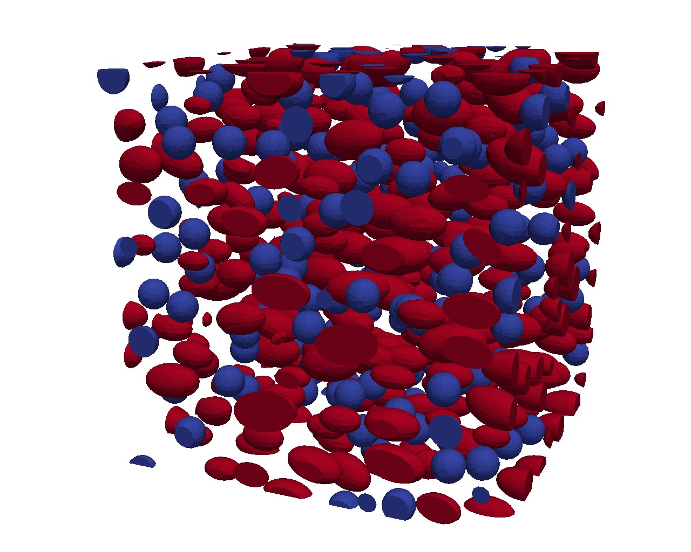

# Statement of need

The understanding of the behaviour of complex materials is fundamental to use them in the limits of their capabilities, whether the material is natural and traditional, such as wood and soils, or modern synthetics, as is a fiber reinforced polymer, for example. These complex materials often are heterogeneous, as is nearly every material at a small enough scale. 
An important class of heterogeneous materials is particle reinforced composites. These advanced engineering materials can be found in a number of applications, such as aerospace, aircraft and automotive industries, microelectronics, household applications and many more.

Simulating an entire structural part considering all its heterogeneities, often very small comparative to the part size, can be very time consuming and extremely impractical.
Thus, a multiscale approach emerged, where if one knows the microstructural features of the material:

1. the properties of the constituents,
2. the properties of the interface,
3. and the geometry of each phase,

one can obtain its macroscale properties using a process known as computational homogenization.
Thus, this requires the generation of a representative volume element (RVE), that is, in broad terms, a small volume element representative of the entire microstructure in an average sense [@HILL1963357].

GMMD enters as a solution for generating RVEs for particle reinforced materials, saving researchers and designers much time, especially if a large number of samples is required.
It can also facilitate machine learning based material design, since it can generate the microstructure datasets to train machine learning models. This can replace slow, iterative design cycles with a faster, automated process and also enable a greater design space exploration [@BESSA2017320].

GMMD is, thus, an open-source Python tool built to generate microstructures of particle reinforced materials.
It is capable of handling diverse particles (or voids) across both two- and three-dimensional domains (disks, ellipses, squares, spheres, ellipsoids, fibers, and cylinders), supporting variable RVE sizes and numerous microstructure descriptors following different statistical distributions.
The generation of the microstructure is not based on the physical process of which it arose, it is purely geometric. GMMD can, for now, use one of two methods for generating the RVE: molecular dynamics (MD) and random sequential addition (RSA). In a general sense, MD proves to be faster for large volume fractions, and RSA faster for smaller volume fraction.
GMMD can export the final microstructure configuration (PDF for 2D, VTK for 2D and 3D) and can generate 2D simulation GIFs. It also includes built-in tools for performing statistical analyses on the microstructure, such as:

- statistical descriptors (2-point correlation function, Ripley's K function, ...) and
- Voronoi metrics based on the Minkowski Structure Metrics and the Minkowski Irreducible Tensors.

After the generation procedure, the RVE can be discretized in a suitable finite element mesh in order to perform microscale analyses through computational homogenization.

{width=50%}

@VILACHA2021104069 presents the theory behind the molecular dynamics simulation, while the numerical assessment and statistical analysis of the microstructures obtained via molecular dynamics simulation is provided by @FERREIRA2022104068.

GMMD is part of an ecosystem of open source microstructure generators.
Neper [@Neper2011; @Neper2018], for instance, generates polycrystalline microstructures via Laguerre tessellations. The seed positions and weights for tesselation are adjusted via an optimization algorithm until the resulting tesselation converges to the desired morphology.
Kanapy [@Kanapy2019], also taylored for polycrystalline microstructures,  generates microstructures via collision driven particle dynamics.
Albeit not primarily designed for microstructure generation, PoreSpy [@gostick2019porespy] is tailored for porous materials.
Lastly, MicroStrucPy [@hart2020microstructpy] generates microstructures via packing geometries (with controled overlap), approximating them by multi-circles and them using them as seeds to tesselate the domain. It is suitable for polycristaline materials while also handling porous and particle reinforced materials.

GMMD is unique in that it generates microstructures for particle reinforced materials, it supports a broad library of particle shapes and its architecture allows for easy integration of new ones and can use time driven molecular dynamics or random sequentian adsorption as the generation method, not making use of tesselation nor optimization.

For more information on how to use and/or contribute to this code, visit our documentation and  repository.
<!-- A documentação não está feita-->

<!--
Vale a pena mencionar todos estes softwares?
Vale a pena falar também de softwares comerciais? Os que tenho aqui são todos open-source.

There are several open-source softwares for microstructure generation.
- Neper and Kanapy are softwares that generate and mesh microstructures. Both focus on polycristaline microstructures.
- PoreSpy can, among other capabilities, generate microstructures, albeit not being the main functionality. It is taylored for porous materials.
- DREAM.3D (simplnx)...
- TexGen allows for designing of a textile with varying number of yarns and different interlacing schemes.
- MicroStructPy: generation and meshing of microstrcutures. It does not have particles like squares, ellipsoids, fibers and cylinders.

Nos softwares de geração, vale a pena ver o método de geração?

Incluir imagem de uma microestrutura?

-->

# AI usage disclosure

The code was first built in 2020, when generative AI tools where not mainstream. In this period, no AI was used.
Upwards of 2025, AI was used to haste the writting of the code, albeit not having a part in its core logic.
For writting the manuscript, the authors used generative AI tools only to check spelling and grammar.

# Acknowledgements

Falar da bolsas (JOSS obriga).

# References